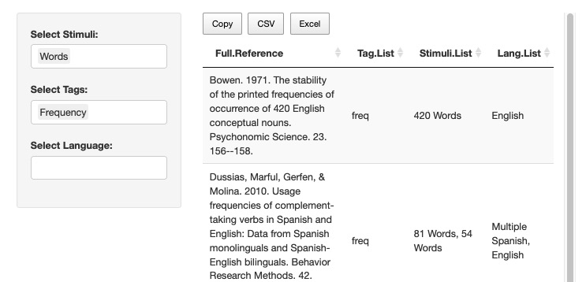
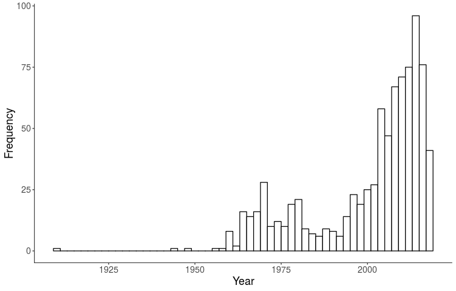

```{r setup, include=FALSE, message=F}
knitr::opts_chunk$set(echo = FALSE, message = F, warning = F)
library(kableExtra)
library(knitr)
library(dplyr)
```

## The Team

- Ari L. Cunningham - Missouri State University
- Erin M. Buchanan - Harrisburg University \@aggieerin
- Nikhil Chate - Harrisburg University
- Jonathan Korn - Harrisburg University

```{r logos, echo=FALSE, out.width="50%", fig.align="center"}


```

## What is the LAB?

- The LAB: Linguistic Annotated Bibliography with the **Language Goldmine**
- Nearly 900 publications coded by language, stimuli, and keywords for 100 years of research 
- Data and metadata for researchers to search

```{r lab_now, echo=FALSE, out.width="75%", fig.align="center"}

```

## What is the need? 

- The addition of new information to these resources is currently manual
- To be useful, the database should be kept relatively current to assist researchers in knowing what is out there for research purposes

```{r pubs_year, echo=FALSE, out.width="50%", fig.align="center"}

```

## Automation: Curate the Training Data

- The LAB data was used as a source of "gold standard" examples for articles to include
- However, the list of articles we excluded for the LAB was not available
- To collect examples of non-included and new data, we used the following:
  - Lexical database, linguistic database (as compound phrases)
  - Lexical norms, linguistic norms
  - Corpus, norms (only in two journals)
  
## Automation: Curate the Training Data

- Websites and journals currently used:
  - EBSCO host for PsycINFO
  - PLoS One
  - Behavior Research Methods
  - Language Resources and Evaluation (Computers and the Humanities)

## Automation: Curate the Training Data

- In order to ease future research, we automated the process of combining, cleaning, and marking data
- Only small manual edits of duplicate titles across searches is required

```{r table, echo = F, results = 'asis'}
resource_table <- read.csv("table_resources.csv", stringsAsFactors = F)
kable(resource_table, align = c("l", "r", "r", "r", "r"),
      col.names = c("Search Term", "BRM", "LRE", "PsycINFO", "PLoS One")) %>% 
  kable_styling(bootstrap_options = c("striped", "hover"))
```

## Automation: What are the features?

- The keywords, titles, and abstracts from articles were used as the training information
  - Data was lowercased
  - Stopwords were removed
  - All punctuation and numbers were removed
  - Data was generally stemmed or lemmatized based on algorithm 

## Automation: What are the features?

semantic ambiguity homonyms meaning frequency homonym norming methods data 
movie subtitles free association homonym meaning annotations comparison 
homonym meaning frequency estimates derived movie television subtitles 
free association explicit ratings words ambiguous interpretation dependent 
context advancing theories ambiguity resolution important general theory language 
processing resolving inconsistencies observed ambiguity effects experimental tasks 
focusing homonyms words bank unrelated meanings edge river financial institution 
present work advances theories methods estimating relative frequency meanings factor 
shapes observed ambiguity effects develop method estimating meaning frequency based 
meaning homonym evoked lines movie television subtitles human raters replicate extend 
measure meaning frequency derived classification free associates evaluate internal 
consistency measures compare published estimates based explicit ratings meaning 
frequency compare set norms predicting performance lexical semantic decision mega 


## Automation: Building an algorithm

- The new data were hand coded for yes/no inclusion (*n* = 3267)
  - BRM: 49% yes, *n* = 1030
  - LRE: 23% yes, *n* = 961
  - Everything else: 34% yes, *n* = 1276

## Automation: Building an algorithm

- Each author tried their own prediction model
  - Data was split into training and testing for all pre-2019 data
  - 2019 data was used as a second test of accuracy
- Models included:
  - Naive Bayes with the top 500 terms as features
  - spaCy pipeline with bag of words and logistic regression
  - spaCy pipeline with bag of words and linear support vector classifier (SVC)
  - Keras and Tensorflow one-dimensional C-LSTM (a combination of a convolutional neural network and recurrent neural network)

## Automation: Results

- spaCy with logistic regression: (pre-, post-2019)
  - Accuracy: 88%, 88%
  - Precision: 86%, 87%
  - Recall: 81%, 72%

```{r table2, echo = F, results = 'asis'}
tableprint = matrix(c(138,7,18,47), nrow = 2, ncol = 2, byrow = T)
rownames(tableprint) = c("Not Included", "Included")

kable(tableprint, align = c("c", "c"),
      col.names = c("Predicted No", "Predicted Yes"),
      row.names = T) %>% 
  kable_styling(bootstrap_options = c("striped", "hover"))
```

## What appears to be most informative?

- Across all four models we see approximately the same results:
  - It's easier to predict the larger not include category, with 90% accuracy
  - It's harder to predict the included category, with 80% accuracy 
- Top features for non-included articles:
  - computational, printout, introduction, review, volume, statistical, news, biology, medicine, life, tone, science 
- Top features for included articles:
  - yelp, archive, goldmine, wordnet, database, normative, familiarity, concreteness, imageability, rated/ing, arousal, valence, standardized

## What are we missing?

- In the included category (labeled as not included):
  - We mostly miss new corpora/WordNets/TreeBanks
  - Tools and resources are also often missed 
- In the non-included category (labeled as included):
  - The articles discuss *using* corpora in their abstract

## What happens next? 

- Article processing queue will be created to update ten articles a month: 

1) All articles found in this search procedure  
2) Users can submit their suggestions for LAB2.0 articles on our new shiny app
3) Articles with high classification probabilities from the algorithm
4) Articles with at least two "yes" votes from LAB2.0 

- Each month, newly published articles will be processed through the algorithm
  - The probability scores from the model will be used to classify articles, which will be displayed to users
  - Up to ten new articles will be added to the LAB2.0 queue based on probability score
  - All other articles will be added to the website for voting purposes 

- This procedure allows us to keep the LAB and users updated!

## Thanks and Sources

- Thank you for your attention!
- Check out our work on github: https://github.com/doomlab/LAB2
- Look at all the word resources on http://wordnorms.com/
- Questions?

## Extra Info on the C-LSTM Model

The model is a hybrid deep learning architecture as detailed below:

- Batch size = 64, embedding dimensions = 2000, CNN layers/(filters) = 128, kernel size = 4, epochs = 500, pool size = 4, LSTM layers/(filters) = 128
- Embedding layers with a max of 10000 features, embedding dimensions, and an input length equal to the max length of 1000. 
- 1 dimensional CNN layers with (filters), kernel size, kernel regularization (L1 = 0.01 & L2 = 0.01), padding set equal to "same", an activation of "relu", and strides equal to L1.
- 1 dimensional CNN layer with (filters), kernel size, kernel regularization (L1 = 0.01 & L2 = 0.01), padding set equal to "same", an activation of "relu", and strides equal to L1. 
- Drop out layer of 0.10. 
- 1 dimensional CNN layers with (filters), kernel size, kernel regularization (L1 = 0.01 & L2 = 0.01), padding set equal to "same", an activation of "relu", and strides equal to L1.
- 1 dimensional CNN layer with (filters), kernel size, kernel regularization (L1 = 0.01 & L2 = 0.01), padding set equal to "same", an activation of "relu", and strides equal to L1. 
- Max pooling layer with pool size = 4. 
- Batch normalization layer
- LSTM layers with (LSTM filters) 
- Sigmoid activation for binary responses.
